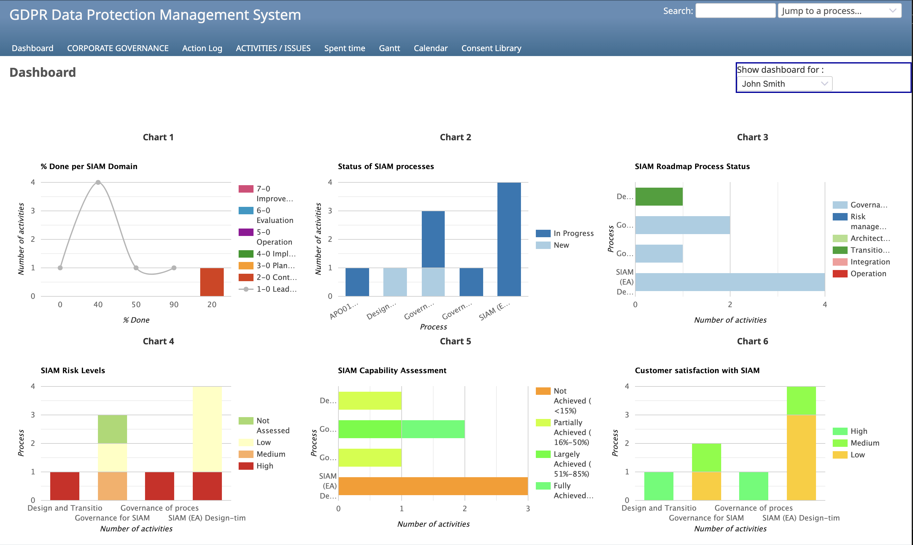
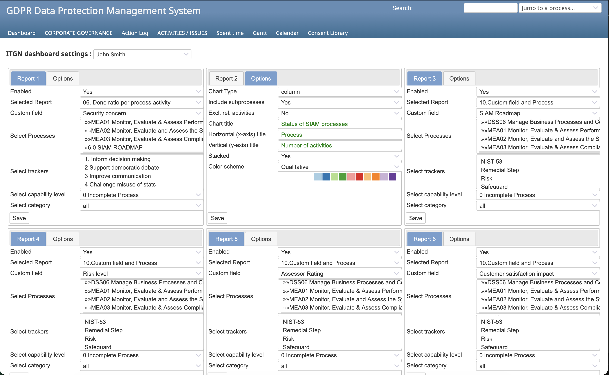

# ITGN Dashboard

A Redmine plugin providing configurable dashboards for IT Governance, Risk, and Compliance (GRC) management.

## Features

- **6 configurable chart slots per user** - Each user can configure up to 6 different charts on their dashboard
- **11 pre-built report types** including:
  - Process completion ratios
  - Privacy risk assessments  
  - Overdue activities
  - Status per process
  - Time spent per activity
  - Capability ratings
  - Custom field analysis
- **Multiple chart types** - Line, bar, column, pie, and area charts
- **Color schemes** - Including Red→Green and Brown→Blue gradients for maturity/compliance visualization
- **Per-user configuration** - Admins can configure dashboards for any user
- **Export to CSV** - Double-click any chart to view full-size and export data
- **Multi-language support** - English, Dutch, and German

## Screenshots




## Requirements

- Redmine 5.0+ or 6.0+
- Ruby 3.0+
- Rails 7.0+

## Installation

1. Clone or download this repository to your Redmine plugins folder:
   ```bash
   cd /path/to/redmine/plugins
   git clone https://github.com/gteley/itgn_dashboard.git
   ```

2. Run database migrations:
   ```bash
   cd /path/to/redmine
   bundle exec rake redmine:plugins:migrate RAILS_ENV=production
   ```

3. Restart Redmine

4. Configure the plugin in Administration → Plugins → ITGN Dashboard

## Configuration

### Admin Setup

1. Go to Administration → ITGN Dashboard
2. Select a user from the dropdown
3. For each of the 6 report slots:
   - Enable/disable the report
   - Select report type
   - Choose processes/trackers to include
   - Set chart type and color scheme
   - Configure axis titles

### User View

Users with configured dashboards will see a "Dashboard" menu item. The dashboard displays all enabled charts with the configured settings.

## Usage with GRC Frameworks

This plugin is designed to work with Redmine instances configured for GRC management. It expects:

- **Projects** representing processes or control domains
- **Issues** representing activities, controls, or tasks
- **Custom fields** for risk levels, compliance status, capability ratings, etc.
- **Trackers** for different activity types (e.g., Risk, Safeguard, Remediation)

Example framework configurations:
- ISO 27001/27002
- COBIT
- NIST Cybersecurity Framework
- GDPR/POPIA compliance
- SIAM (Service Integration and Management)

## License

MIT License

Copyright (c) 2015-2025 Teley Consultancy BV

Permission is hereby granted, free of charge, to any person obtaining a copy
of this software and associated documentation files (the "Software"), to deal
in the Software without restriction, including without limitation the rights
to use, copy, modify, merge, publish, distribute, sublicense, and/or sell
copies of the Software, and to permit persons to whom the Software is
furnished to do so, subject to the following conditions:

The above copyright notice and this permission notice shall be included in all
copies or substantial portions of the Software.

THE SOFTWARE IS PROVIDED "AS IS", WITHOUT WARRANTY OF ANY KIND, EXPRESS OR
IMPLIED, INCLUDING BUT NOT LIMITED TO THE WARRANTIES OF MERCHANTABILITY,
FITNESS FOR A PARTICULAR PURPOSE AND NONINFRINGEMENT. IN NO EVENT SHALL THE
AUTHORS OR COPYRIGHT HOLDERS BE LIABLE FOR ANY CLAIM, DAMAGES OR OTHER
LIABILITY, WHETHER IN AN ACTION OF CONTRACT, TORT OR OTHERWISE, ARISING FROM,
OUT OF OR IN CONNECTION WITH THE SOFTWARE OR THE USE OR OTHER DEALINGS IN THE
SOFTWARE.

## Author

**Guus Teley** - [Teley Consultancy](https://www.teley.nl)

## Contributing

Contributions are welcome! Please feel free to submit a Pull Request.

## Changelog

See [init.rb](init.rb) for version history.
